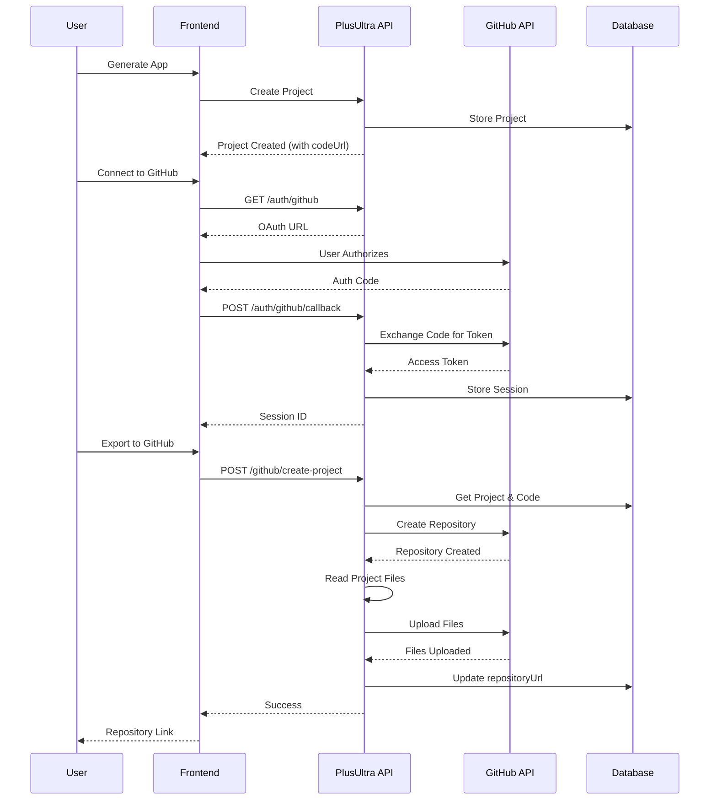
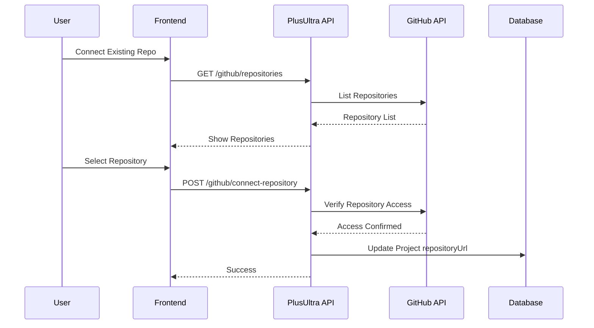

# GitHub Integration Documentation

## Overview

PlusUltra provides seamless GitHub integration that allows users to automatically create or connect their GitHub repositories when building applications. This feature enables users to:

1. Authenticate with GitHub via OAuth 2.0
2. Create new repositories for their generated projects
3. Connect existing repositories to their projects
4. Automatically push generated code to GitHub

## Architecture

### Services

#### GitHubService ([src/services/github/GitHubService.ts](src/services/github/GitHubService.ts))
Core service for GitHub API interactions:
- OAuth 2.0 authentication
- Repository CRUD operations
- File upload to repositories
- User and repository information retrieval

#### GitHubExportService ([src/services/github/GitHubExportService.ts](src/services/github/GitHubExportService.ts))
Orchestrates the export of generated projects to GitHub:
- Reads project files (from directory or ZIP)
- Creates repositories
- Uploads all project files in commits
- Validates repository access

#### ProjectService ([src/services/storage/ProjectService.ts](src/services/storage/ProjectService.ts))
Manages project data and integrates with GitHub:
- Stores `repositoryUrl` for GitHub-linked projects
- Tracks project metadata and status
- Manages project members and permissions

### API Endpoints

All endpoints are defined in [src/routes/auth/github.ts](src/routes/auth/github.ts):

#### 1. Initiate GitHub OAuth
```
GET /api/v1/auth/github
```
Returns the GitHub OAuth URL for user authentication.

**Response:**
```json
{
  "success": true,
  "authUrl": "https://github.com/login/oauth/authorize?...",
  "state": "plusultra-1234567890-abc123"
}
```

#### 2. OAuth Callback
```
POST /api/v1/auth/github/callback
```
Exchanges authorization code for access token and creates a session.

**Request:**
```json
{
  "code": "github_auth_code",
  "state": "plusultra-1234567890-abc123"
}
```

**Response:**
```json
{
  "success": true,
  "sessionId": "github_session_12345_1234567890",
  "user": {
    "id": 12345,
    "login": "username",
    "name": "User Name",
    "avatar_url": "https://avatars.githubusercontent.com/..."
  },
  "accessToken": "gho_..."
}
```

#### 3. Get User Repositories
```
GET /api/v1/github/repositories
Headers: { "x-github-session": "github_session_12345_1234567890" }
```
Retrieves all repositories for the authenticated user.

**Response:**
```json
{
  "success": true,
  "repositories": [
    {
      "id": 123456,
      "name": "my-app",
      "full_name": "username/my-app",
      "description": "My app description",
      "private": false,
      "html_url": "https://github.com/username/my-app",
      "clone_url": "https://github.com/username/my-app.git",
      "created_at": "2024-01-01T00:00:00Z",
      "updated_at": "2024-01-02T00:00:00Z",
      "language": "TypeScript"
    }
  ]
}
```

#### 4. Create Repository and Export Project
```
POST /api/v1/github/create-project
Headers: { "x-github-session": "github_session_12345_1234567890" }
```
Creates a new GitHub repository and uploads the generated project code.

**Request:**
```json
{
  "projectId": "uuid-of-project",
  "userId": "uuid-of-user",
  "repositoryName": "my-new-app",
  "description": "My new React Native app",
  "private": false
}
```

**Response:**
```json
{
  "success": true,
  "repository": {
    "html_url": "https://github.com/username/my-new-app",
    "clone_url": "https://github.com/username/my-new-app.git"
  },
  "message": "Project successfully exported to GitHub"
}
```

#### 5. Connect Existing Repository
```
POST /api/v1/github/connect-repository
Headers: { "x-github-session": "github_session_12345_1234567890" }
```
Links an existing GitHub repository to a PlusUltra project.

**Request:**
```json
{
  "projectId": "uuid-of-project",
  "userId": "uuid-of-user",
  "repositoryOwner": "username",
  "repositoryName": "existing-repo"
}
```

**Response:**
```json
{
  "success": true,
  "repository": {
    "html_url": "https://github.com/username/existing-repo",
    "clone_url": "https://github.com/username/existing-repo.git"
  },
  "message": "Repository successfully connected to project"
}
```

#### 6. Get GitHub User Info
```
GET /api/v1/github/user
Headers: { "x-github-session": "github_session_12345_1234567890" }
```
Retrieves detailed information about the authenticated GitHub user.

#### 7. Disconnect GitHub Session
```
POST /api/v1/auth/github/disconnect
Headers: { "x-github-session": "github_session_12345_1234567890" }
```
Invalidates the GitHub session.

## Workflow

### Creating a New Repository with Generated Code



### Connecting an Existing Repository



## Environment Variables

Required environment variables for GitHub integration:

```bash
# GitHub OAuth App Credentials
GITHUB_CLIENT_ID=your_github_client_id
GITHUB_CLIENT_SECRET=your_github_client_secret
GITHUB_REDIRECT_URI=http://localhost:3000/auth/github/callback

# Database (for project storage)
DATABASE_URL=postgresql://...
SUPABASE_URL=https://...
SUPABASE_SERVICE_ROLE_KEY=...

# Redis (for session management)
REDIS_URL=redis://localhost:6379
```

## Setup Instructions

### 1. Create GitHub OAuth App

1. Go to GitHub Settings → Developer settings → OAuth Apps
2. Click "New OAuth App"
3. Fill in the details:
   - Application name: PlusUltra
   - Homepage URL: https://your-domain.com
   - Authorization callback URL: https://your-domain.com/auth/github/callback
4. Click "Register application"
5. Copy the Client ID and generate a Client Secret
6. Add these to your `.env` file

### 2. Configure Required Scopes

The GitHub OAuth integration requests the following scopes:
- `repo` - Full control of private repositories
- `public_repo` - Access to public repositories

These scopes allow PlusUltra to:
- Create repositories
- Upload files to repositories
- Read repository information

### 3. Database Setup

The `repositoryUrl` field is already included in the Prisma schema:

```prisma
model Project {
  id                String         @id @default(uuid())
  organizationId    String
  name              String
  slug              String
  description       String?
  repositoryUrl     String?        // GitHub repository URL
  framework         String?
  language          String?
  createdAt         DateTime       @default(now())
  updatedAt         DateTime       @updatedAt
  // ...
}
```

Run migrations if needed:
```bash
npm run db:migrate
```

## File Upload Strategy

The `GitHubExportService` supports two file upload strategies:

### Sequential Upload (Current Implementation)
- Uploads files one by one using `createOrUpdateFileContents`
- Each file creates a separate commit
- Simple and reliable
- Good for debugging

### Batch Upload (Future Enhancement)
- Uses Git Tree API to create a single commit with all files
- More efficient for large projects
- Atomic operation
- Requires more complex implementation

## Security Considerations

1. **Access Tokens**: GitHub access tokens are stored in Redis with 24-hour expiration
2. **State Parameter**: OAuth state parameter is validated to prevent CSRF attacks
3. **Session Management**: Sessions are scoped to Redis with TTL
4. **File Validation**: Binary files and large files are filtered during upload
5. **Repository Permissions**: Only repositories the user owns/has access to can be connected

## Error Handling

Common errors and their handling:

| Error | Status Code | Description |
|-------|-------------|-------------|
| Repository already exists | 409 | The repository name is already taken |
| Invalid session | 401 | GitHub session expired or invalid |
| Project not found | 404 | Project doesn't exist or user lacks access |
| No generated code | 400 | Project must be generated before export |
| Upload failed | 500 | GitHub API error during file upload |

## Testing

### Manual Testing

1. **Test OAuth Flow**:
   ```bash
   curl http://localhost:3000/api/v1/auth/github
   # Follow the authUrl, authorize, and capture the code
   curl -X POST http://localhost:3000/api/v1/auth/github/callback \
     -H "Content-Type: application/json" \
     -d '{"code": "your_code", "state": "your_state"}'
   ```

2. **Test Repository Creation**:
   ```bash
   curl -X POST http://localhost:3000/api/v1/github/create-project \
     -H "x-github-session: your_session_id" \
     -H "Content-Type: application/json" \
     -d '{
       "projectId": "uuid",
       "userId": "uuid",
       "repositoryName": "test-app",
       "description": "Test app",
       "private": false
     }'
   ```

### Integration Tests

See [tests/github-integration.test.ts](tests/github-integration.test.ts) for comprehensive test suite.

## Roadmap

Future enhancements:

- [ ] GitHub Webhooks for repository updates
- [ ] Automatic CI/CD setup (GitHub Actions)
- [ ] Branch management and pull request creation
- [ ] Continuous sync between PlusUltra and GitHub
- [ ] GitHub Apps integration (instead of OAuth)
- [ ] Support for GitHub Enterprise
- [ ] Binary file upload support
- [ ] Large file handling with Git LFS
- [ ] Batch upload using Git Tree API

## Support

For issues or questions:
- GitHub Issues: https://github.com/your-org/plusultra/issues
- Documentation: https://docs.plusultra.com/github-integration
- Community: https://discord.gg/plusultra
